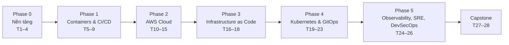

# Chương trình học DevOps & Cloud (AWS-first)

> **Hồ sơ người học:** Developer đã có kinh nghiệm code/git, mới với DevOps.
> **Mục tiêu:** Đủ năng lực ứng tuyển vị trí DevOps / SRE (junior–mid).
> **Thời lượng:** 28 tuần (~6.5 tháng) × ~10 giờ/tuần ≈ 280 giờ.
> **Cloud chính:** AWS (so sánh Azure/GCP ở mức khái niệm).
> **Chứng chỉ mục tiêu:** AWS Solutions Architect – Associate (tuần 15), CKA (tuần 23), Terraform Associate (tuỳ chọn, tuần 18).

---

## 1. Nguyên tắc học

| Nguyên tắc | Cách áp dụng |
|---|---|
| **Lab > lý thuyết** | Mỗi tuần: ~3h đọc/xem, ~5h lab, ~1h ghi chú/blog, ~1h ôn tập (quiz/flashcard) |
| **Một app xuyên suốt** | Dùng 1 ứng dụng mẫu (tuần 4) cho mọi module: containerize → CI/CD → AWS → Terraform → K8s → observability |
| **Mọi thứ là code** | Script, Dockerfile, pipeline, Terraform, manifest đều nằm trong Git |
| **Tự phá rồi tự sửa** | Cố tình làm hỏng (xoá pod, chặn port, đầy disk) để luyện debug |
| **Kiểm soát chi phí AWS** | Bật AWS Budgets alert ($10), `terraform destroy` sau mỗi lab, ưu tiên `kind`/local trước khi lên EKS |
| **Học công khai** | Ghi lại mỗi module thành 1 bài viết ngắn → portfolio |

---

## 2. Tổng quan lộ trình

| Tuần | Phase | Module | Deliverable |
|---|---|---|---|
| 1–2 | 0 | M01 Linux & Shell | Script tự động hoá + VM đã hardening |
| 3 | 0 | M02 Networking | Nginx reverse proxy + HTTPS |
| 4 | 0 | M03 DevOps mindset & Git workflow | Repo app mẫu có branch protection |
| 5–6 | 1 | M04 Docker | App 3-tier chạy bằng Docker Compose |
| 7–8 | 1 | M05 CI/CD với GitHub Actions | Pipeline test → scan → build → push |
| 9 | 1 | ✅ Checkpoint 1 | Auto-deploy app lên 1 VM |
| 10 | 2 | M06 Cloud & AWS core / IAM | Tài khoản AWS an toàn (MFA, budget, IAM roles) |
| 11–12 | 2 | M07 AWS Networking & Compute | VPC 2-AZ + ALB + ASG |
| 13 | 2 | M08 Storage, Database, Serverless | App dùng RDS + S3 + 1 Lambda |
| 14 | 2 | M09 Well-Architected, HA/DR, Cost | Tài liệu kiến trúc + DR plan |
| 15 | 2 | ✅ Checkpoint 2 + ôn AWS SAA | App HA trên AWS, thi thử SAA ≥ 80% |
| 16–17 | 3 | M10 Terraform | Dựng lại Checkpoint 2 bằng Terraform |
| 18 | 3 | M11 Ansible & Packer | Playbook cấu hình + AMI build tự động |
| 19–20 | 4 | M12 Kubernetes core | App chạy trên `kind` với probes, HPA |
| 21 | 4 | M13 Kubernetes production & EKS | EKS bằng Terraform + Helm chart |
| 22 | 4 | M14 GitOps với Argo CD | Deploy dev/staging/prod qua Git |
| 23 | 4 | ✅ Checkpoint 3 + ôn CKA | killer.sh ≥ 70% |
| 24 | 5 | M15 Observability | Dashboard + alert cho golden signals |
| 25 | 5 | M16 SRE practices | SLO + error budget + postmortem mẫu |
| 26 | 5 | M17 DevSecOps | Pipeline có SAST/SCA/image signing |
| 27–28 | — | 🏁 Capstone | Production-grade platform (xem mục 5) |

> **Buffer:** Nếu chậm, ưu tiên hoàn thành lab/deliverable; phần "Mở rộng" của mỗi module có thể bỏ qua.

---

## 3. Chi tiết từng module

### Phase 0 — Nền tảng (Tuần 1–4)

#### M01. Linux & Shell Scripting · Tuần 1–2

**Mục tiêu:** Tự tin vận hành server Linux qua terminal, viết script tự động hoá.

**Chủ đề**
- Filesystem hierarchy (FHS), permissions (`chmod`, `chown`, umask), users/groups, `sudo`
- Process: `ps`, `top/htop`, signals, `nice`, background jobs
- `systemd`: unit file, `systemctl`, `journalctl`
- Package management (`apt`/`dnf`), disk (`df`, `du`, `lsblk`, mount), log rotation
- Text processing: `grep`, `sed`, `awk`, `jq`, pipes & redirection
- Bash scripting: biến, điều kiện, vòng lặp, function, exit code, `set -euo pipefail`, `trap`
- SSH: key-based auth, `~/.ssh/config`, SCP/rsync, tắt password login
- Cron & systemd timers

**Lab**
1. Tạo VM (Multipass/UTM/VirtualBox hoặc EC2 free tier), tạo user, cấu hình SSH key, tắt root login.
2. Viết `backup.sh`: nén thư mục, giữ 7 bản gần nhất, log ra journald, chạy bằng systemd timer.
3. Viết `healthcheck.sh`: kiểm tra CPU/RAM/disk, cảnh báo khi vượt ngưỡng.
4. Viết 1 systemd service chạy app Node/Python đơn giản, tự restart khi crash.

**Tiêu chí đạt:** Không cần GUI; debug được "service không start" chỉ bằng `systemctl status` + `journalctl`.

**Tài liệu:** *The Linux Command Line* (William Shotts, miễn phí) · linuxjourney.com · OverTheWire Bandit (luyện CLI) · ShellCheck

---

#### M02. Networking cho DevOps · Tuần 3

**Mục tiêu:** Hiểu request đi từ browser tới server như thế nào và debug được lỗi mạng.

**Chủ đề**
- Mô hình OSI / TCP-IP; TCP vs UDP; 3-way handshake
- IPv4, CIDR, subnetting, private vs public IP, NAT
- DNS: record types (A, AAAA, CNAME, MX, TXT), TTL, resolve flow
- HTTP/1.1 vs HTTP/2, status codes, headers; TLS handshake, certificate chain
- Load balancer L4 vs L7, reverse proxy, forward proxy
- Firewall: `ufw`/`iptables`/`nftables` cơ bản
- Công cụ: `ip`, `ss`, `dig`, `curl -v`, `traceroute`, `tcpdump`, `nc`

**Lab**
1. Tính tay subnet: chia `10.0.0.0/16` thành 4 subnet public + 4 private (dùng lại ở M07).
2. Cài Nginx làm reverse proxy cho 2 app backend, cân bằng tải round-robin.
3. Gắn domain + HTTPS bằng Let's Encrypt (certbot); redirect HTTP → HTTPS.
4. Dùng `tcpdump` bắt gói tin một request HTTP và giải thích từng bước.

**Tiêu chí đạt:** Giải thích được `curl https://example.com` từ DNS lookup tới response.

**Tài liệu:** Julia Evans – *Networking zines* · Cloudflare Learning Center · `man dig`, `man ss`

---

#### M03. DevOps mindset & Git workflow · Tuần 4

**Mục tiêu:** Hiểu DevOps là văn hoá + thực hành, chuẩn bị app mẫu dùng xuyên suốt khoá.

**Chủ đề**
- DevOps là gì: CALMS, Three Ways, vòng đời Plan → Code → Build → Test → Release → Deploy → Operate → Monitor
- DORA metrics: deployment frequency, lead time, change failure rate, time to restore
- The Twelve-Factor App
- Branching: trunk-based development vs GitFlow; PR review; conventional commits; semantic versioning
- Branch protection, CODEOWNERS, pre-commit hooks
- DevOps vs SRE vs Platform Engineering

**Lab — App mẫu xuyên suốt**
Tạo repo `sample-app` gồm: **frontend** (tĩnh hoặc React) + **API** (Node/Python/Go tuỳ bạn) + **PostgreSQL** + **Redis** (cache). Yêu cầu:
- Cấu hình qua env vars (12-factor), endpoint `/healthz` và `/metrics` (để dành cho M15)
- Unit test chạy được bằng 1 lệnh
- README, `.editorconfig`, pre-commit hooks, branch protection trên `main`

**Tiêu chí đạt:** App chạy local, test pass, repo có quy trình PR rõ ràng.

**Tài liệu:** *The Phoenix Project* · *The DevOps Handbook* · 12factor.net · dora.dev · roadmap.sh/devops

---

### Phase 1 — Containers & CI/CD (Tuần 5–9)

#### M04. Docker & Containers · Tuần 5–6

**Mục tiêu:** Đóng gói mọi service thành image nhỏ, an toàn, reproducible.

**Chủ đề**
- Container vs VM; namespaces & cgroups (khái niệm); OCI image
- Image layers, build cache, `.dockerignore`
- Dockerfile best practices: multi-stage build, pin version, non-root user, distroless/alpine, `HEALTHCHECK`
- Networking (bridge, host), volumes vs bind mounts
- Docker Compose: multi-service, depends_on + healthcheck, profiles, env files
- Registry: Docker Hub, GitHub Container Registry (GHCR), Amazon ECR; tagging strategy (git SHA + semver)
- Security: quét image với Trivy/Grype, không nhét secret vào image
- Mở rộng: Podman, BuildKit, `docker buildx` multi-arch

**Lab**
1. Viết Dockerfile cho API: so sánh kích thước image trước/sau multi-stage (mục tiêu giảm ≥ 50%).
2. `compose.yaml` chạy full stack (frontend, API, Postgres, Redis) với healthcheck & volume.
3. Quét image bằng Trivy, sửa hết lỗi CRITICAL.
4. Push image lên GHCR với tag = git SHA.

**Tiêu chí đạt:** `docker compose up` là chạy toàn bộ app trên máy mới; image chạy non-root.

**Tài liệu:** docs.docker.com (Get started + Best practices) · *Docker Deep Dive* (Nigel Poulton) · Trivy docs

---

#### M05. CI/CD với GitHub Actions · Tuần 7–8

**Mục tiêu:** Mỗi commit được test, quét bảo mật, build và sẵn sàng deploy tự động.

**Chủ đề**
- CI vs Continuous Delivery vs Continuous Deployment
- GitHub Actions: workflow, job, step, runner, trigger (`push`, `pull_request`, `workflow_dispatch`)
- Matrix build, caching dependencies, artifacts, reusable workflows, composite actions
- Secrets, environments, required reviewers; **OIDC** tới cloud (không dùng access key tĩnh)
- Pipeline chuẩn: lint → unit test → SAST → build image → scan → push → deploy
- Chiến lược deploy: rolling, blue-green, canary, feature flags; rollback
- Tổng quan công cụ khác: GitLab CI, Jenkins, CircleCI (để đọc hiểu job description)

**Lab**
1. Workflow CI cho PR: lint + test + coverage report, chặn merge khi fail.
2. Workflow CD khi merge `main`: build → Trivy scan → push GHCR, tag semver khi tạo release.
3. Tạo reusable workflow dùng chung cho nhiều service.
4. Thêm Dependabot/Renovate cập nhật dependency tự động.

**Tiêu chí đạt:** Từ lúc merge đến lúc có image mới < 10 phút, không có secret nào hard-code.

**Tài liệu:** docs.github.com/actions · GitHub Actions security hardening guide

---

#### ✅ Checkpoint 1 · Tuần 9

**Project:** Auto-deploy app mẫu lên 1 VM (EC2 t3.micro hoặc VPS).
- Merge vào `main` → pipeline build & push image → SSH/SSM vào VM → `docker compose pull && up -d`
- Nginx + HTTPS phía trước, zero-downtime cơ bản (healthcheck trước khi chuyển traffic)
- Viết README: sơ đồ kiến trúc, cách rollback về version trước

**Tự đánh giá:** Làm lại toàn bộ trên VM mới trong < 1 giờ nhờ script.

---

### Phase 2 — AWS Cloud (Tuần 10–15)

#### M06. Cloud Fundamentals & AWS Core / IAM · Tuần 10

**Mục tiêu:** Nắm mô hình cloud, thiết lập tài khoản AWS an toàn, làm chủ IAM.

**Chủ đề**
- IaaS / PaaS / SaaS / FaaS; shared responsibility model
- Region, Availability Zone, edge location
- Mapping dịch vụ AWS ↔ Azure ↔ GCP (bảng so sánh)
- IAM: users, groups, roles, policies (identity-based vs resource-based), least privilege, policy evaluation logic
- IAM Identity Center (SSO), MFA, AWS Organizations & SCP (khái niệm)
- AWS CLI v2, profiles, `aws sts get-caller-identity`
- Billing: AWS Budgets, Cost Explorer, Free Tier và các "bẫy" chi phí (NAT Gateway, EIP, EKS, data transfer)
- CloudTrail (audit)

**Lab**
1. Khoá root account (MFA, không access key), tạo admin qua IAM Identity Center.
2. Tạo AWS Budget alert $10 và $25 gửi email.
3. Viết IAM policy tối thiểu cho phép chỉ đọc/ghi 1 S3 bucket; kiểm chứng bằng IAM Policy Simulator.
4. Cấu hình GitHub Actions → AWS bằng **OIDC role** (thay access key).

**Tài liệu:** AWS Skill Builder – Cloud Practitioner Essentials · AWS IAM docs

---

#### M07. AWS Networking & Compute · Tuần 11–12

**Mục tiêu:** Thiết kế VPC production và chạy app có khả năng tự scale.

**Chủ đề**
- VPC, subnet public/private, Internet Gateway, NAT Gateway, route tables
- Security Group vs NACL; VPC endpoints (Gateway/Interface); VPC peering & Transit Gateway (khái niệm)
- EC2: instance types, AMI, user data, EBS, instance profile; SSM Session Manager (thay SSH/bastion)
- Auto Scaling Group, launch template, scaling policies
- Elastic Load Balancing: ALB vs NLB, target groups, health checks
- Route 53 (routing policies), ACM (certificate), CloudFront (CDN)
- Container trên AWS: ECR, ECS Fargate (tổng quan, để so sánh với EKS sau này)

**Lab**
1. Dựng VPC 2 AZ theo subnet đã tính ở M02 (bằng Console — ghi lại từng bước để làm Terraform ở M10).
2. ASG chạy app mẫu trong private subnet, phía trước là ALB ở public subnet, HTTPS bằng ACM.
3. Truy cập instance chỉ qua SSM Session Manager, không mở port 22.
4. Load test (k6/hey) để kích hoạt scale-out, rồi quan sát scale-in.

**Tiêu chí đạt:** Tắt 1 AZ (terminate instances) → app vẫn phục vụ.

**Tài liệu:** AWS VPC docs · Adrian Cantrill – AWS SAA course (khuyến nghị cao)

---

#### M08. Storage, Database & Serverless · Tuần 13

**Chủ đề**
- S3: storage classes, lifecycle, versioning, bucket policy, block public access, pre-signed URL, static website
- EBS vs EFS vs S3
- RDS/Aurora: Multi-AZ vs read replica, backup/snapshot, parameter groups
- DynamoDB (partition key, capacity modes), ElastiCache Redis
- Lambda, API Gateway, event-driven: SQS, SNS, EventBridge
- Secrets Manager vs SSM Parameter Store

**Lab**
1. Chuyển Postgres của app sang RDS Multi-AZ (private subnet), Redis sang ElastiCache.
2. Upload file người dùng lên S3 qua pre-signed URL; lifecycle chuyển sang IA sau 30 ngày.
3. Lambda xử lý ảnh (resize) khi có object mới trên S3 qua event notification.
4. Lấy DB password từ Secrets Manager thay vì env file.

---

#### M09. Well-Architected, HA/DR & Cost Optimization · Tuần 14

**Chủ đề**
- AWS Well-Architected Framework: 6 pillars (Operational Excellence, Security, Reliability, Performance Efficiency, Cost Optimization, Sustainability)
- High availability vs fault tolerance vs disaster recovery
- RTO/RPO; chiến lược DR: backup & restore, pilot light, warm standby, multi-site active/active
- AWS Backup, cross-region replication
- Cost: right-sizing, Savings Plans/Reserved, Spot, tagging strategy, cost allocation
- CloudWatch cơ bản: metrics, logs, alarms

**Lab**
1. Vẽ sơ đồ kiến trúc app (draw.io/diagrams-as-code) và tự review theo Well-Architected Tool.
2. Viết DR plan: RTO/RPO mục tiêu, thử restore RDS từ snapshot và đo thời gian.
3. Gắn tag `project/env/owner` cho mọi resource, xem chi phí theo tag trên Cost Explorer.

---

#### ✅ Checkpoint 2 + Ôn AWS SAA · Tuần 15

**Project:** App mẫu chạy HA trên AWS: CloudFront → ALB → ASG (private) → RDS Multi-AZ + ElastiCache + S3; CI/CD deploy qua OIDC; CloudWatch alarms.

**Ôn thi:** Tutorials Dojo practice exams (mục tiêu ≥ 80% ổn định) → đăng ký thi **AWS Certified Solutions Architect – Associate** (kiểm tra mã đề thi hiện hành trên trang AWS Certification).

> ⚠️ Chụp lại cấu hình / ghi chú rồi **xoá resource** (NAT Gateway, RDS, ALB tính tiền theo giờ).

---

### Phase 3 — Infrastructure as Code (Tuần 16–18)

#### M10. Terraform · Tuần 16–17

**Mục tiêu:** Mọi hạ tầng AWS tạo/xoá/tái tạo được bằng code, review qua PR.

**Chủ đề**
- IaC: declarative vs imperative; Terraform vs CloudFormation vs CDK vs Pulumi; OpenTofu
- HCL: provider, resource, data source, variable, output, locals, `for_each`, `count`, dynamic blocks
- State: local vs remote; S3 backend với native state locking (`use_lockfile`) thay cho DynamoDB lock kiểu cũ; state commands (`mv`, `import`, `rm`)
- Modules: tự viết + dùng module registry (terraform-aws-modules)
- Quản lý nhiều môi trường: thư mục theo env vs workspaces; Terragrunt (tổng quan)
- Quy trình: `fmt` → `validate` → `tflint` → `checkov/trivy config` → `plan` trên PR → `apply` sau approve
- Drift detection, `moved`/`import` blocks, lifecycle rules

**Lab**
1. Viết module `vpc`, `alb-asg`, `rds` của riêng bạn; dựng lại toàn bộ Checkpoint 2 cho env `dev` và `staging`.
2. Remote state trên S3 (versioning + encryption + locking).
3. GitHub Actions: comment `terraform plan` vào PR, `apply` khi merge (qua OIDC, environment approval).
4. Tạo drift bằng tay trên Console → phát hiện bằng `plan` → xử lý.

**Tiêu chí đạt:** `terraform destroy` rồi `apply` lại → app hoạt động mà không chỉnh tay bước nào.

**Tài liệu:** developer.hashicorp.com/terraform/tutorials · *Terraform: Up & Running* (Yevgeniy Brikman)

---

#### M11. Configuration Management: Ansible & Packer · Tuần 18

**Chủ đề**
- Configuration management vs provisioning; mutable vs immutable infrastructure
- Ansible: inventory (static & dynamic AWS), playbook, roles, handlers, templates (Jinja2), Vault, idempotency
- Packer: build AMI "golden image"
- Khi nào dùng Ansible vs user data vs container image

**Lab**
1. Role Ansible cài & harden server (users, SSH, ufw, fail2ban, node_exporter).
2. Packer + Ansible build AMI; Terraform launch template dùng AMI mới nhất.
3. (Tuỳ chọn) Ôn & thi **HashiCorp Terraform Associate**.

---

### Phase 4 — Kubernetes & GitOps (Tuần 19–23)

#### M12. Kubernetes Core · Tuần 19–20

**Mục tiêu:** Deploy và vận hành app trên Kubernetes, nền tảng cho CKA.

**Chủ đề**
- Kiến trúc: control plane (API server, etcd, scheduler, controller manager), node (kubelet, kube-proxy, container runtime)
- Objects: Pod, ReplicaSet, Deployment, StatefulSet, DaemonSet, Job/CronJob
- Service (ClusterIP, NodePort, LoadBalancer), DNS nội bộ; Ingress và **Gateway API**
- ConfigMap, Secret, env & volume mounts
- Probes (liveness, readiness, startup), resource requests/limits, QoS
- HPA, PodDisruptionBudget, rolling update & rollback
- Storage: PV, PVC, StorageClass
- Namespace, RBAC (Role, ClusterRole, ServiceAccount), NetworkPolicy
- Scheduling: nodeSelector, affinity, taints/tolerations
- Troubleshooting: `kubectl describe/logs/exec/events`, CrashLoopBackOff, ImagePullBackOff, Pending
- Công cụ: `kind`/`minikube`, `kubectl`, `k9s`, `kubectx/kubens`

**Lab**
1. Dựng cluster `kind` 3 node; deploy full app mẫu (Postgres dùng StatefulSet + PVC).
2. Thêm probes, requests/limits, HPA; load test để thấy scale.
3. Gateway API/Ingress route `/` → frontend, `/api` → API.
4. RBAC: tạo ServiceAccount chỉ được `get/list` pod trong 1 namespace; NetworkPolicy chỉ cho API gọi DB.
5. "Break & fix": 10 bài tự gây lỗi và sửa (sai image, sai selector, thiếu secret, OOMKilled…).

**Tài liệu:** kubernetes.io/docs (Tasks) · *Kubernetes the Hard Way* (Kelsey Hightower) · KodeKloud CKA course

---

#### M13. Kubernetes Production & Amazon EKS · Tuần 21

**Chủ đề**
- Helm: chart structure, values, templating, dependencies; Kustomize: base/overlays
- EKS: managed node groups vs Fargate; tạo cluster bằng Terraform (module `terraform-aws-modules/eks`)
- Quyền truy cập AWS từ pod: EKS Pod Identity / IRSA
- AWS Load Balancer Controller, ExternalDNS, cert-manager
- Autoscaling node: Karpenter vs Cluster Autoscaler
- EBS CSI driver; cluster upgrades; chi phí EKS

**Lab**
1. Viết Helm chart cho app mẫu (values riêng cho dev/staging/prod).
2. Terraform dựng EKS + add-ons; deploy chart; ALB tự tạo từ Ingress/Gateway.
3. Pod đọc S3 qua Pod Identity (không có access key).
4. Karpenter scale node khi tăng replicas.

> ⚠️ EKS control plane tính tiền theo giờ — dựng, làm lab, `destroy` trong ngày.

---

#### M14. GitOps với Argo CD · Tuần 22

**Chủ đề**
- GitOps principles: declarative, versioned, pulled automatically, continuously reconciled
- Argo CD: Application, ApplicationSet, app-of-apps, sync policies, health, rollback
- Tách repo app code vs repo manifests (config repo); promotion dev → staging → prod
- Secrets trong GitOps: External Secrets Operator (AWS Secrets Manager), Sealed Secrets
- Progressive delivery: Argo Rollouts (canary, blue-green) — tổng quan
- Flux CD (so sánh)

**Lab**
1. Cài Argo CD; tạo config repo với Kustomize overlays cho 3 môi trường.
2. CI cập nhật image tag trong config repo → Argo CD tự sync.
3. External Secrets Operator lấy DB password từ AWS Secrets Manager.
4. Canary release với Argo Rollouts, rollback khi error rate tăng.

---

#### ✅ Checkpoint 3 + Ôn CKA · Tuần 23

- Luyện tốc độ `kubectl` imperative (`kubectl create/run/expose --dry-run=client -o yaml`), alias, vim
- Chủ đề trọng tâm CKA: cluster setup/upgrade bằng kubeadm, etcd backup/restore, troubleshooting, networking, storage, workloads, Helm/Kustomize, Gateway API
- Làm bài thi thử **killer.sh** (đi kèm khi đăng ký CKA) → mục tiêu ≥ 70% → đăng ký **CKA**

---

### Phase 5 — Observability, SRE & DevSecOps (Tuần 24–26)

#### M15. Observability · Tuần 24

**Chủ đề**
- Monitoring vs observability; 3 trụ cột: metrics, logs, traces
- Phương pháp: Four Golden Signals, RED (services), USE (resources)
- Prometheus: pull model, exporters, PromQL, recording rules; kube-prometheus-stack
- Grafana dashboards; Alertmanager (routing, silence, inhibition)
- Logs: Loki + Promtail/Grafana Alloy hoặc Fluent Bit → CloudWatch
- Tracing: OpenTelemetry (SDK + Collector), Tempo/Jaeger
- CloudWatch Container Insights; so sánh SaaS (Datadog, New Relic)

**Lab**
1. Cài kube-prometheus-stack; app mẫu expose `/metrics`; dashboard RED cho API.
2. Instrument API bằng OpenTelemetry → traces vào Tempo; liên kết log ↔ trace bằng trace ID.
3. Alert: error rate > 5% trong 5 phút, p95 latency > 500ms → gửi Slack/Discord/email.

---

#### M16. SRE Practices · Tuần 25

**Chủ đề**
- SLI, SLO, SLA; error budget & error budget policy
- Alert theo SLO (multi-window, multi-burn-rate)
- Toil và cách loại bỏ; capacity planning
- Incident management: severity, incident commander, communication, on-call
- Blameless postmortem; runbooks/playbooks
- Chaos engineering (Chaos Mesh / LitmusChaos / AWS FIS), game day

**Lab**
1. Định nghĩa 2 SLO cho app (availability 99.5%, latency p95 < 300ms); dashboard error budget.
2. Viết runbook cho 3 alert quan trọng.
3. Game day: dùng Chaos Mesh kill pod / inject latency → xử lý theo runbook → viết postmortem.

**Tài liệu:** *Site Reliability Engineering* & *The SRE Workbook* (miễn phí tại sre.google/books)

---

#### M17. DevSecOps & Supply Chain Security · Tuần 26

**Chủ đề**
- Shift-left security; OWASP Top 10 (mức DevOps cần biết)
- SAST (Semgrep, CodeQL), SCA (Dependabot, Trivy), secret scanning (gitleaks), DAST (OWASP ZAP)
- IaC scanning (Checkov, Trivy config); container & K8s benchmark (CIS, kube-bench)
- Supply chain: SBOM (Syft), ký image (cosign/Sigstore), SLSA levels
- Policy as code: OPA Gatekeeper / Kyverno (chặn image chưa ký, chặn container root)
- Secrets management: HashiCorp Vault vs AWS Secrets Manager; rotation
- AWS security services: GuardDuty, Security Hub, KMS, WAF (tổng quan)

**Lab**
1. Thêm vào pipeline: gitleaks + Semgrep + Trivy (image & IaC) + SBOM; fail khi có CRITICAL.
2. Ký image bằng cosign (keyless qua GitHub OIDC); Kyverno chỉ cho chạy image đã ký.
3. Kyverno policy: bắt buộc requests/limits, cấm `latest` tag, cấm privileged.

---

## 4. Lịch mẫu 1 tuần (~10h)

| Ngày | Thời lượng | Hoạt động |
|---|---|---|
| Thứ 2 | 1.5h | Đọc/xem lý thuyết phần 1 |
| Thứ 3 | 1.5h | Đọc/xem lý thuyết phần 2 + ghi chú |
| Thứ 4 | 1.5h | Lab 1 |
| Thứ 5 | 1.5h | Lab 2 |
| Thứ 7 | 3h | Lab lớn / break & fix / deliverable |
| Chủ nhật | 1h | Quiz ôn tập + viết bài tổng kết tuần + cập nhật tiến độ |

---

## 5. 🏁 Capstone Project · Tuần 27–28

**Đề bài:** *Production-grade platform cho app mẫu trên AWS* — dùng làm portfolio chính khi phỏng vấn.

**Yêu cầu bắt buộc**
- [ ] Hạ tầng 100% Terraform (VPC, EKS, RDS, ElastiCache, S3, IAM), remote state, 2 môi trường
- [ ] CI (GitHub Actions): test → SAST/SCA → build → scan → SBOM → sign → push ECR (OIDC)
- [ ] CD bằng Argo CD (GitOps), canary cho API
- [ ] Secrets qua External Secrets Operator + AWS Secrets Manager
- [ ] Observability: Prometheus/Grafana/Loki/OpenTelemetry, alert theo SLO
- [ ] Policy: Kyverno (image đã ký, không root, có limits)
- [ ] Autoscaling pod (HPA) + node (Karpenter)
- [ ] Tài liệu: sơ đồ kiến trúc, ADR (Architecture Decision Records), runbook, DR plan, báo cáo chi phí/tháng ước tính
- [ ] Script `make up` / `make down` dựng & xoá toàn bộ

**Bonus**
- Demo video 5 phút; bài blog "Từ commit tới production"
- Multi-region DR (pilot light) hoặc so sánh chi phí EKS vs ECS Fargate

---

## 6. Sau lộ trình — Hướng mở rộng

| Hướng | Chủ đề |
|---|---|
| Platform Engineering | Backstage (Internal Developer Portal), golden paths, Crossplane |
| Service Mesh & eBPF | Istio / Linkerd, Cilium, mTLS |
| FinOps | Kubecost/OpenCost, FinOps Framework |
| Multi-cloud | Azure (AKS, AZ-104) hoặc GCP (GKE, ACE) |
| Nâng cao chứng chỉ | AWS DevOps Engineer – Professional, CKS (Kubernetes security) |
| MLOps / AI infra | GPU nodes trên K8s, KServe, model serving |
| Programming cho DevOps | Go (viết CLI, K8s operator), Python automation (boto3) |

---

## 7. Theo dõi tiến độ

Mỗi module được coi là **hoàn thành** khi:
1. Tất cả lab đã làm và code nằm trong Git
2. Deliverable đạt "Tiêu chí đạt"
3. Quiz module ≥ 80%
4. Có 1 bài ghi chú/blog tóm tắt những gì học được

> Website học tập (sẽ build ở bước tiếp theo) sẽ dựa trên cấu trúc file này: mỗi module = 1 trang gồm lý thuyết, lab, quiz, checklist tiến độ.
