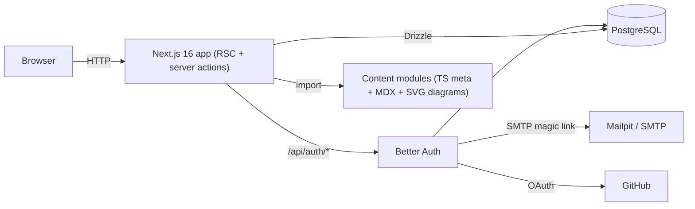

# System Architecture

## Overview

Single Next.js application. Content is **compiled into the app** (MDX via `@next/mdx`); only user data lives in the database.

## Layers

| Layer | Location | Notes |
|---|---|---|
| Routes / pages | `src/app` | Server components; per-request session lookup → dynamic rendering |
| Server actions | `src/app/actions/learning-progress-actions.ts` | Auth check, zod validation, registry validation, DB write, `revalidatePath` |
| Auth | `src/lib/auth` | Better Auth + Drizzle adapter; plugins: `magicLink`, `nextCookies`; GitHub provider enabled only if env set |
| Progress domain | `src/lib/progress` | Pure functions (grader, calculator, heatmap, item keys) + `learning-progress-repository.ts` (DB) + `user-progress-snapshot.ts` (composition) |
| Content | `src/content` | `ModuleDefinition` per module, registry, lookup helpers, validator |
| UI kit | `src/components` | Lesson MDX components, diagram kit, progress widgets |
| DB | `src/db` | Drizzle schema: Better Auth tables + `progress_item`, `quiz_attempt` |

## Data model

- `user`, `session`, `account`, `verification` — Better Auth core tables.
- `progress_item (user_id, item_key, completed_at)` — PK `(user_id, item_key)`. `item_key` = `mXX:lesson:<slug>` or `mXX:lab:<id>`. Presence = done.
- `quiz_attempt (id, user_id, module_id, score, total, answers jsonb, created_at)` — every attempt kept; best score drives completion.

Module complete ⇔ all lessons ✓ + all labs ✓ + best quiz ≥ 80%. Module % counts lessons, labs and quiz as equal units; overall % averages modules.

## Key flows

**Mark lesson/lab done** — client checkbox (optimistic via `useOptimistic`) → `toggleProgressItemAction` → session required → key must exist in registry (rejects forged keys) → upsert/delete → revalidate.

**Quiz** — quiz page sends questions **without** answers/explanations (`toPublicQuizQuestions`) → learner submits indices → `submitQuizAction` grades with server-side answer key → stores attempt → returns per-question results + explanations.

**Lesson rendering** — `/modules/[moduleSlug]/lessons/[lessonSlug]` validates slugs against registry, then dynamic-imports `@/content/modules/<slug>/lessons/<lesson>.mdx`. Global MDX components come from `src/mdx-components.tsx`; diagrams are client components imported inside each MDX file.

**Theme** — class-based dark mode (`.dark` on `<html>`), `next/script` `beforeInteractive` applies saved/system theme before paint; code blocks use rehype-pretty-code dual themes.

## Quality gates

- `pnpm validate:module <slug>` — content rules + MDX compile per module
- `src/content/curriculum-registry.test.ts` — all registered modules pass validator, unique ids/slugs/orders
- Unit tests for grading, progress math, item keys, heatmap
- `pnpm lint`, `pnpm typecheck` (runs `next typegen` for `PageProps`/`LayoutProps`), `pnpm build`

## Local infrastructure

`docker-compose.yml`: `postgres:17-alpine` on host port 5433 (volume `postgres-data`), `axllent/mailpit` SMTP 1025 / UI 8025. Deployment target not chosen yet (out of scope for current phase).
