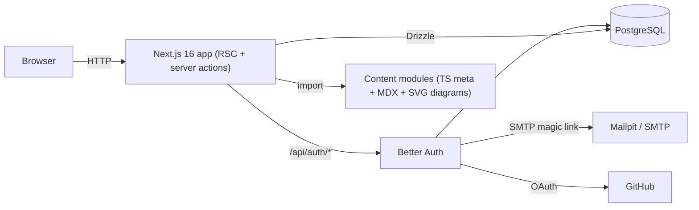

# System Architecture

## Overview



Single Next.js application. Content is **compiled into the app** (MDX via `@next/mdx`); only user data lives in the database.

## Layers

| Layer | Location | Notes |
|---|---|---|
| Routes / pages | `src/app` | Server components; per-request session lookup → dynamic rendering |
| Server actions | `src/app/actions/learning-progress-actions.ts` | Auth check, zod validation, registry validation, DB write, `revalidatePath` |
| Auth | `src/lib/auth` | Better Auth + Drizzle adapter; plugins: `magicLink`, `nextCookies`; GitHub provider enabled only if env set |
| Progress domain | `src/lib/progress` | Pure functions (quiz grader, lab submission grader, calculator, heatmap, item keys) + `learning-progress-repository.ts` (DB) + `user-progress-snapshot.ts` (composition) |
| Review domain | `src/lib/review` | Pure scheduler/deck/queue (`spaced-repetition-scheduler.ts`, `flashcard-deck-builder.ts`, `review-queue-builder.ts`, `flashcard-card-keys.ts`) + `card-review-repository.ts` (DB) + `review-queue-snapshot.ts` (composition) |
| Content | `src/content` | `course-registry.ts` (courses + phases), `curriculum-registry.ts` (modules), lookup helpers, validator |
| UI kit | `src/components` | Lesson MDX components, diagram kit, progress widgets |
| DB | `src/db` | Drizzle schema: Better Auth tables + `progress_item`, `quiz_attempt`, `lab_submission`, `card_review_state` |

## Content model (multi-course)

```
Course (course-registry.ts) ─┬─ Phase (devops-course-phases.ts, system-design-course-phases.ts; phase.courseId)
                             └─ Module (modules/<slug>/module-meta.ts; module.phaseId → phase → course)
```

- A module's course is **derived from its phase** — module meta files carry no `courseId`.
- Module `id` (`m01`, `sd01`) and `slug` are **unique across all courses**; `order` is unique within a course. Enforced by `curriculum-registry.test.ts`.
- Routes: `/` course picker · `/courses/[courseSlug]` roadmap · `/modules/[moduleSlug]/…` (course-agnostic) · `/roadmap` 308 → `/courses/devops-cloud` (`next.config.ts`).

## Data model

- `user`, `session`, `account`, `verification` — Better Auth core tables.
- `progress_item (user_id, item_key, completed_at)` — PK `(user_id, item_key)`. `item_key` = `<moduleId>:lesson:<slug>` or `<moduleId>:lab:<id>`. Presence = done. **Single source of truth** for "is this done" — a passed lab submission writes here, nothing else changes.
- `quiz_attempt (id, user_id, module_id, score, total, answers jsonb, created_at)` — every attempt kept; best score drives completion.
- `lab_submission (id, user_id, module_id, lab_id, content, passed, check_results jsonb, created_at)` — every submission attempt kept (history), indexed on `(user_id, module_id, lab_id)`. Only labs with a `submission` spec (`LabDefinition.submission`) use this table; other labs keep the plain `progress_item` self-tick. Live on `m01`–`m04` (16 labs of the DevOps course's ~68): 13 auto-graded (`checks.length > 0`) + 3 evidence-only (`checks: []`, self-attested, stored but not graded).
- `card_review_state (user_id, card_id, module_id, ease_factor_basis_points, interval_days, repetitions, lapses, due_at, last_reviewed_at)` — PK `(user_id, card_id)`, indexed on `(user_id, due_at)`. One row per (user, flashcard) SM-2 state; ease factor stored as an integer ×100 (exact across both Postgres drivers). Cards are derived from existing quiz questions, never hand-authored — `card_id` = `<moduleId>:card:<quizQuestionId>` (`src/lib/review/flashcard-card-keys.ts`), a namespace deliberately separate from `progress_item`'s `lesson`/`lab` item keys so a forged card id can never mark a lesson/lab complete. Pilot scope gated by `REVIEW_PILOT_MODULE_IDS` (`m01`–`m03`) in `flashcard-deck-builder.ts`.

No course column anywhere: globally unique module ids make progress rows unambiguous, so adding a course needs no migration. Progress is **never silently revoked**: if an author later tightens a `submission` spec, a lab already marked done via `progress_item` stays done — re-verification, if ever needed, is a deliberate future decision, not automatic.

Module complete ⇔ all lessons ✓ + all labs ✓ + best quiz ≥ 80%. Module % counts lessons, labs and quiz as equal units; course % averages that course's modules (`summarizeCourseProgress`). Dashboard "continue" banner picks the most recently active unfinished course (`continue-course-picker.ts`).

## Key flows

**Mark lesson/lab done** — client checkbox (optimistic via `useOptimistic`) → `toggleProgressItemAction` → session required → key must exist in registry (rejects forged keys) → **auto-graded labs rejected here** (`isAutoGradedLabKey`: `submission.checks.length > 0` — it can only be completed via "Submit lab" below; unchecking stays allowed). Evidence-only labs (`checks: []`) are *not* rejected by this guard — `isAutoGradedLabKey` only inspects `checks.length`, so a direct `toggleProgressItemAction(completed: true)` call would still mark one done without a stored submission. In practice the UI never renders the checkbox for any lab with `submission` set (`hasSubmission` in `lab-checklist-card.tsx`), so this path is unreachable through normal use; it is a deliberate KISS trade-off — evidence-only labs are self-attested by definition, so an extra server rejection was judged not worth the added complexity — not a server-side hard gate.

**Quiz** — quiz page sends questions **without** answers/explanations (`toPublicQuizQuestions`) → learner submits indices → `submitQuizAction` grades with server-side answer key → stores attempt → returns per-question results + explanations.

**Submit lab** (live: m01–m04) — module page projects each lab's `submission` spec through `toPublicLabSubmissionSpec` before it reaches the client `LabChecklistCard`/`LabSubmissionPanel` (matchers never leave the server) → learner pastes real command output → `submitLabAction`: session required → zod-bounded (`moduleSlug`, `labId`, `content` ≤ 10 000 chars) → lab resolved from the registry (never trusted from the client) → `gradeLabSubmission` (pure, `src/lib/progress/lab-submission-grader.ts`) → `insertLabSubmission` (history row, always) → on pass (or on an evidence-only lab with `checks: []`) → `setProgressItemCompleted` (same table/path as the checkbox) → revalidate. Neon HTTP has no interactive transactions, so the submission row is written **before** the progress row — a partial failure leaves recoverable evidence, never a phantom "done" with no proof. `LabChecklistCard` renders exactly one completion control per lab: legacy checkbox when `submission` is absent, status dot + submit panel whenever `submission` is present (graded or evidence-only) — see `hasSubmission` in `lab-checklist-card.tsx`.

**Accepted risk — no ReDoS guard on author regexes.** Author-written `regex`/`numberInRange` patterns (`LabCheckMatcher`) run against learner-controlled input (≤ 10 000 chars) with no execution timeout. Accepted for the current 16-lab, single-maintainer-authored surface: every shipped pattern is a plain alternation or bounded character class with no nested quantifiers (manually reviewed, see the m01–m03 rollout report), the input is capped, and the attacker must be an authenticated learner. **Revisit trigger:** authoring opens beyond the core maintainer, or the graded-lab count passes ~50.

**Lesson rendering** — `/modules/[moduleSlug]/lessons/[lessonSlug]` validates slugs against registry, then calls the module's loader in `src/content/lesson-content-loaders.ts` (one scoped dynamic import per registered module, so an unregistered in-progress module can't break the bundle). Global MDX components come from `src/mdx-components.tsx`; diagrams are client components imported inside each MDX file.

**Spaced-repetition review (pilot: m01–m03)** — a module's cards only enter the queue once its quiz has been attempted (eligibility gate, reusing `getBestQuizPercentByModule`) so reviewing a card never spoils/previews the quiz. `/review` (session required, login prompt otherwise) → `getReviewQueueSnapshot(userId)` builds the session queue from the pure deck (`buildPilotDeck`, derived from quiz questions — front = `recallPrompt ?? question`, back = correct option + explanation) + stored per-card state + eligibility → client `ReviewSessionRunner` reveals a card then rates it (Again/Hard/Good/Easy) → `submitCardReviewAction`: session required → zod-validated grade → `isKnownFlashcardId` allowlist (rejects forged ids) → `scheduleNextReview` (pure SM-2, `reviewedAt` generated server-side only) → single `upsertCardReviewState` upsert (Neon HTTP has no interactive transactions, same constraint as lab submissions). Deliberately **no** `revalidatePath` per rating — a session fires ~20 times and the dashboard is already dynamically rendered, so the next navigation reads fresh data regardless. The dashboard derives eligibility from data it already loaded (`getUserProgressSnapshot`) and shows a due-count stat + CTA banner, at zero extra query cost.

**Theme** — class-based dark mode (`.dark` on `<html>`), `next/script` `beforeInteractive` applies saved/system theme before paint; code blocks use rehype-pretty-code dual themes.

## Quality gates

- `pnpm validate:module <slug>` — content rules + MDX compile per module
- `src/content/curriculum-registry.test.ts` — courses/phases/modules consistent, ids/slugs globally unique, orders unique per course, every module has a loader and passes the validator
- Unit tests for grading (quiz + lab submission), progress math, course summary, continue-course picker, item keys, heatmap
- `pnpm lint`, `pnpm typecheck` (runs `next typegen` for `PageProps`/`LayoutProps`), `pnpm build`

## Local infrastructure

`docker-compose.yml`: `postgres:17-alpine` on host port 5433 (volume `postgres-data`), `axllent/mailpit` SMTP 1025 / UI 8025.

## Production

Vercel (functions pinned to `sin1` via `vercel.json`) + Neon Postgres (Singapore) through Neon's HTTP driver when `VERCEL` is set (`src/db/database-client.ts`), Resend SMTP for magic links. See `docs/deployment-guide.md`.
