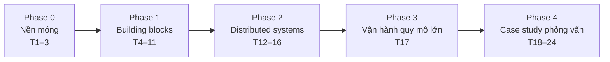

# Chương trình học System Design (nền tảng + phỏng vấn)

> **Hồ sơ người học:** Developer đã có kinh nghiệm code (backend/web), đã hoặc đang học course DevOps & Cloud; chưa từng thiết kế hệ thống quy mô lớn.
> **Mục tiêu:** (1) Hiểu *vì sao* hệ thống lớn được thiết kế như vậy — đủ để ra quyết định kiến trúc ở công việc thật; (2) tự tin vượt vòng system design interview (mid–senior).
> **Thời lượng:** 24 tuần × ~10 giờ/tuần ≈ 240 giờ · 19 module · 5 phase.
> **Ngôn ngữ lab:** code mẫu TypeScript/Node chạy bằng Docker Compose; người học có thể dùng ngôn ngữ quen tay.

---

## 1. Nguyên tắc học

| Nguyên tắc | Cách áp dụng |
|---|---|
| **Yêu cầu trước, hộp vẽ sau** | Mọi bài thiết kế bắt đầu bằng functional / non-functional requirements và ước lượng quy mô — không vẽ kiến trúc khi chưa biết "bao nhiêu user, đọc hay ghi nhiều". |
| **Không có đáp án đúng, chỉ có trade-off** | Mỗi quyết định ghi rõ: chọn gì, bỏ gì, đổi lại được gì, khi nào nên đổi ý. Bảng trade-off là "sản phẩm" quan trọng nhất của mỗi lab. |
| **Tự đo để tin** | Building blocks (cache, replica, queue, rate limiter…) được dựng thật trên máy bằng Docker Compose và đo bằng k6 — thấy số latency/throughput thay đổi thì mới nhớ lâu. |
| **Một playground xuyên suốt** | Dựng 1 lần ở SD01 (`sd-playground`: Nginx, app Node, Postgres, Redis, Redpanda, k6, Toxiproxy), mỗi module thêm/bật thành phần mới. |
| **Viết design doc như đi làm** | Từ Phase 1, mỗi module có ≥1 design doc ngắn theo template (Phụ lục A). Phase 4 dùng chính template đó để luyện phỏng vấn. |
| **Luyện nói ra thành tiếng** | Case study làm trong 45 phút bấm giờ, tự ghi âm/giải thích cho người khác — phỏng vấn chấm cách *dẫn dắt*, không chỉ kiến trúc cuối. |

---

## 2. Tổng quan lộ trình



| Tuần | Phase | Module | Deliverable |
|---|---|---|---|
| 1–2 | 0 | SD01 Tư duy system design & ước lượng | Bảng ước lượng cho 3 hệ thống + playground chạy được |
| 3 | 0 | SD02 Networking & giao tiếp giữa service | So sánh đo đạc REST vs gRPC, demo WebSocket/SSE |
| 4 | 1 | SD03 Scaling & load balancing | App stateless sau Nginx LB + báo cáo k6 |
| 5 | 1 | SD04 Caching & CDN | Cache-aside có số đo hit-rate & p95 trước/sau |
| 6–7 | 1 | SD05 Database nền tảng | Schema + index có `EXPLAIN ANALYZE`, demo isolation anomaly |
| 8 | 1 | SD06 Scale database | Postgres primary/replica + consistent hashing tự viết |
| 9–10 | 1 | SD07 Async & messaging | Outbox + consumer idempotent trên Redpanda |
| 11 | 1 | SD08 Storage & search | Upload qua presigned URL + search full-text |
| 12 | 2 | SD09 Consistency, CAP & replication | Demo quorum/stale read + bảng chọn consistency |
| 13–14 | 2 | SD10 Consensus & coordination | Distributed lock có fencing token + ghi chú Raft |
| 15 | 2 | SD11 Reliability patterns | Retry/backoff/circuit breaker/rate limiter đo bằng Toxiproxy |
| 16 | 2 | SD12 Microservices & API design | Design doc tách service + saga cho luồng đặt hàng |
| 17 | 3 | SD13 SLO, capacity & multi-region | Capacity plan + DR plan (RPO/RTO) + ước tính chi phí |
| 18 | 4 | SD14 Case: URL shortener & rate limiter | URL shortener mini chạy được + design doc |
| 19 | 4 | SD15 Case: News feed & notification | Design doc fan-out + prototype timeline |
| 20 | 4 | SD16 Case: Chat & presence | Design doc + prototype WebSocket nhiều instance |
| 21 | 4 | SD17 Case: Video streaming & file sync | 2 design doc (YouTube, Dropbox) |
| 22–23 | 4 | SD18 Case: Proximity, booking & payment | 3 design doc + demo chống double-booking |
| 24 | 4 | SD19 Mock interview & capstone | 3 mock interview bấm giờ + capstone design doc |

> **Buffer:** Chậm tiến độ thì ưu tiên design doc + bảng trade-off; lab đo đạc có thể làm rút gọn (chỉ chạy 1 kịch bản).

---

## 3. Chi tiết từng module

### Phase 0 — Nền móng (Tuần 1–3)

#### SD01. Tư duy system design & ước lượng · Tuần 1–2

**Mục tiêu:** Có một framework cố định để tiếp cận mọi bài thiết kế và ước lượng được quy mô bằng tính nhẩm.

**Chủ đề**
- System design là gì; khác gì "code một feature"; vì sao không có đáp án đúng
- Framework 4 bước: làm rõ yêu cầu → ước lượng → high-level design → đào sâu & trade-off
- Functional vs non-functional requirements: latency, availability, durability, consistency, cost
- Back-of-the-envelope: QPS trung bình/đỉnh, storage theo năm, băng thông, số máy (Phụ lục B)
- Latency numbers (thứ tự độ lớn), bậc 2 (KB/MB/GB/TB), availability "số 9"
- Đọc nhiều hay ghi nhiều (read/write ratio) và vì sao nó quyết định kiến trúc

**Bài học gợi ý:** tư duy & framework 4 bước · requirements & NFR · ước lượng back-of-the-envelope · latency numbers & số 9 availability

**Lab**
1. Dựng `sd-playground` bằng Docker Compose (app Node trả JSON + Postgres + Redis) và chạy k6 smoke test.
2. Ước lượng cho 3 hệ thống (Twitter-like, URL shortener, chat 1-1): DAU, QPS đọc/ghi, storage 5 năm — trình bày thành bảng.
3. Viết requirements (functional + NFR có số cụ thể) cho 1 hệ thống bạn đang làm ở công ty/side project.

**Tiêu chí đạt:** Trong 5 phút ước lượng được QPS và storage của một hệ thống mới, sai không quá 1 bậc độ lớn.

**Tài liệu:** *System Design Interview Vol. 1* (Alex Xu) ch.1–3 · *The System Design Primer* (GitHub donnemartin) · "Latency Numbers Every Programmer Should Know" · Hello Interview – delivery framework

---

#### SD02. Networking & giao tiếp giữa service · Tuần 3

**Mục tiêu:** Chọn đúng kiểu giao tiếp (sync/async, request/stream) cho từng tình huống.

**Chủ đề**
- Hành trình request: DNS → TCP/TLS → HTTP; keep-alive, connection pooling
- HTTP/1.1 vs HTTP/2 (multiplexing) vs HTTP/3 (QUIC); head-of-line blocking
- REST vs gRPC vs GraphQL: khi nào dùng, chi phí serialization, tooling
- Realtime: polling, long polling, Server-Sent Events, WebSocket
- DNS cho scale: TTL, GeoDNS, anycast (khái niệm)

**Bài học gợi ý:** hành trình một request · HTTP/1.1 → 2 → 3 · REST vs gRPC vs GraphQL · realtime: polling, SSE, WebSocket

**Lab**
1. Viết cùng một API bằng REST (JSON) và gRPC; đo payload size và p95 latency bằng k6 (k6 hỗ trợ gRPC).
2. Làm endpoint giá cổ phiếu giả lập 3 kiểu: polling, SSE, WebSocket; so sánh số request và độ trễ nhận update.
3. Dùng `curl -v` và DevTools để xem connection reuse (keep-alive) và HTTP/2 multiplexing.

**Tiêu chí đạt:** Giải thích được vì sao chat dùng WebSocket còn feed thông báo có thể chỉ cần SSE.

**Tài liệu:** *High Performance Browser Networking* (Ilya Grigorik, miễn phí) · gRPC docs · MDN: SSE & WebSocket · Cloudflare Learning Center

---

### Phase 1 — Building blocks (Tuần 4–11)

#### SD03. Scaling & load balancing · Tuần 4

**Mục tiêu:** Scale ngang một app web và hiểu load balancer làm gì khi server chết.

**Chủ đề**
- Vertical vs horizontal scaling; vì sao cần stateless; session ở đâu (sticky vs store ngoài)
- Load balancer L4 vs L7; thuật toán: round robin, least connections, weighted, IP hash
- Health check (active/passive), connection draining, slow start
- Reverse proxy, API gateway (khái niệm, đào sâu ở SD12)
- Autoscaling theo metric; điểm nghẽn tiếp theo sau khi scale app (thường là DB)

**Bài học gợi ý:** vertical vs horizontal & stateless · load balancer L4/L7 · thuật toán cân bằng tải · health check & failover

**Lab**
1. Chạy 3 instance app sau Nginx (round robin → least_conn); k6 50→500 VU, ghi throughput và p95.
2. Kill 1 instance giữa lúc chạy k6; cấu hình `max_fails`/`fail_timeout` để lỗi 5xx giảm; so sánh trước/sau.
3. Chuyển session in-memory sang Redis; chứng minh user không bị đăng xuất khi đổi instance.

**Tiêu chí đạt:** Chỉ ra được bottleneck tiếp theo từ số đo k6 (CPU app hay connection DB).

**Tài liệu:** Nginx docs – HTTP load balancing · AWS ELB docs · *System Design Interview Vol. 1* ch.1 · k6 docs

---

#### SD04. Caching & CDN · Tuần 5

**Mục tiêu:** Đặt cache đúng chỗ, chọn chiến lược invalidation và tránh các sự cố cache kinh điển.

**Chủ đề**
- Các tầng cache: browser, CDN, reverse proxy, application, database
- Chiến lược: cache-aside, read-through, write-through, write-behind; TTL
- Eviction: LRU, LFU; memory sizing
- Sự cố: cache stampede (thundering herd), cache penetration, hot key, stale data
- Redis cơ bản: data structures, persistence (RDB/AOF), không phải "database chính"
- CDN: edge, cache key, `Cache-Control`, purge; static vs dynamic content

**Bài học gợi ý:** các tầng cache · cache-aside và các chiến lược ghi · eviction & invalidation · stampede, penetration, hot key · CDN

**Lab**
1. Thêm cache-aside Redis cho endpoint đọc chậm (Postgres query ~50ms giả lập); đo hit-rate, p95 trước/sau bằng k6.
2. Tái hiện cache stampede khi key hết hạn dưới tải cao; sửa bằng lock (`SET NX PX`) hoặc early expiration; đo lại.
3. Cấu hình `Cache-Control` cho static asset và API; kiểm tra bằng `curl -I`.

**Tiêu chí đạt:** Giải thích được khi nào *không* nên cache và cách xử lý dữ liệu cũ khi update.

**Tài liệu:** Redis docs · AWS Whitepaper "Caching challenges and strategies" (Builders' Library) · Cloudflare Learning – CDN · MDN `Cache-Control`

---

#### SD05. Database nền tảng · Tuần 6–7

**Mục tiêu:** Chọn loại database và thiết kế schema/index phù hợp access pattern.

**Chủ đề**
- SQL vs NoSQL (key-value, document, wide-column, graph) — chọn theo access pattern, không theo trend
- Index: B-tree vs LSM-tree; composite index, covering index; chi phí ghi của index
- Transaction & ACID; isolation levels và anomaly (dirty read, non-repeatable read, phantom, lost update, write skew)
- Locking: pessimistic (`SELECT … FOR UPDATE`) vs optimistic (version column)
- Data modeling: normalize vs denormalize; modeling cho DynamoDB-style (single-table, partition key)

**Bài học gợi ý:** SQL vs NoSQL · index B-tree vs LSM · transaction & isolation · locking · data modeling theo access pattern

**Lab**
1. Tạo bảng 5 triệu dòng; so sánh `EXPLAIN ANALYZE` trước/sau khi thêm composite index; đo chi phí ghi tăng thêm.
2. Tái hiện lost update với 2 transaction đồng thời ở `READ COMMITTED`; sửa bằng `FOR UPDATE` và bằng optimistic locking.
3. Thiết kế schema cho app đặt hàng 2 cách (Postgres normalized và DynamoDB single-table) cho cùng 5 access pattern.

**Tiêu chí đạt:** Nhìn query plan biết vì sao chậm; chọn được isolation level + locking cho luồng trừ tiền.

**Tài liệu:** *Designing Data-Intensive Applications* (Kleppmann) ch.2–3, 7 · Use The Index, Luke! · PostgreSQL docs – Transaction Isolation · AWS DynamoDB best practices

---

#### SD06. Scale database · Tuần 8

**Mục tiêu:** Scale đọc bằng replication và scale ghi bằng sharding, hiểu cái giá phải trả.

**Chủ đề**
- Replication: leader-follower, sync vs async, replication lag, read-your-writes
- Read replica và routing đọc/ghi; failover và nguy cơ mất dữ liệu với async replication
- Partitioning/sharding: range, hash, directory; chọn shard key
- Consistent hashing và virtual nodes; rebalancing
- Hot partition/hot key; cross-shard query & transaction là đắt
- Connection pooling (PgBouncer) và giới hạn connection

**Bài học gợi ý:** replication & replication lag · read replica & failover · sharding & shard key · consistent hashing · hot key & rebalancing

**Lab**
1. Dựng Postgres primary + 1 streaming replica; ghi ở primary, đọc ngay ở replica để thấy lag; đo `pg_stat_replication`.
2. Tự viết consistent hashing (có virtual nodes) bằng TypeScript; thêm/bớt node, đo % key phải di chuyển so với hash `mod N`.
3. Chọn shard key cho bảng `messages` của app chat; viết ra 3 query và query nào phải scatter-gather.

**Tiêu chí đạt:** Giải thích được vì sao shard key sai rất khó sửa và cách xử lý read-your-writes với replica.

**Tài liệu:** DDIA ch.5–6 · PostgreSQL docs – Streaming Replication · paper "Dynamo: Amazon's Highly Available Key-value Store" · Discord blog – How Discord stores messages

---

#### SD07. Async & messaging · Tuần 9–10

**Mục tiêu:** Tách hệ thống bằng hàng đợi/event mà không mất hay xử lý trùng dữ liệu.

**Chủ đề**
- Sync vs async; khi nào cần queue (buffer tải, tách service, retry)
- Message queue vs pub/sub vs log (Kafka): consumer group, partition, ordering theo key, retention
- Delivery semantics: at-most-once, at-least-once, "exactly-once" thực chất là gì
- Idempotency: idempotency key, dedup table; poison message & dead-letter queue
- Transactional outbox, change data capture (khái niệm); backpressure

**Bài học gợi ý:** vì sao cần async · queue vs pub/sub vs log · delivery semantics & idempotency · outbox & CDC · backpressure & DLQ

**Lab**
1. Dựng Redpanda (Kafka API) trong playground; producer/consumer group 3 partition; quan sát ordering theo key và rebalance khi thêm consumer.
2. Làm luồng "đặt hàng → gửi email" bằng transactional outbox (Postgres) + relay; kill relay giữa chừng và chứng minh không mất event.
3. Cho consumer crash sau khi xử lý nhưng trước khi commit offset; sửa bằng idempotency key để không gửi email trùng.

**Tiêu chí đạt:** Thiết kế được luồng async không mất message và không double-xử lý khi mọi thành phần có thể crash.

**Tài liệu:** DDIA ch.11 · Kafka docs – Design · microservices.io – Transactional outbox · Stripe blog – idempotency keys · Redpanda docs

---

#### SD08. Storage & search · Tuần 11

**Mục tiêu:** Lưu file lớn và làm tìm kiếm full-text đúng cách.

**Chủ đề**
- Block vs file vs object storage; S3: durability, storage classes, lifecycle
- Luồng upload: presigned URL, multipart upload, virus scan async, metadata ở DB
- Serving: CDN trước object storage, signed URL cho nội dung private
- Full-text search: inverted index, tokenization, relevance (BM25 khái niệm)
- Elasticsearch/OpenSearch: index, shard, replica; đồng bộ từ DB (dual write vs CDC)

**Bài học gợi ý:** block, file, object storage · upload file lớn · inverted index · search engine & đồng bộ dữ liệu

**Lab**
1. Dựng MinIO (S3-compatible); upload file 200MB bằng presigned URL + multipart từ browser, metadata lưu Postgres.
2. Tự build inverted index nhỏ bằng TypeScript cho 10k bài viết; so sánh với Postgres `tsvector`.
3. Đồng bộ bảng `products` sang OpenSearch qua outbox (tái dùng SD07); sửa 1 sản phẩm và đo độ trễ tới khi search thấy.

**Tiêu chí đạt:** App server không bao giờ phải "cầm" nội dung file upload; giải thích được độ trễ đồng bộ search.

**Tài liệu:** AWS S3 docs – presigned URL, multipart upload · MinIO docs · Elasticsearch: The Definitive Guide (khái niệm) · PostgreSQL docs – Full Text Search

---

### Phase 2 — Distributed systems (Tuần 12–16)

#### SD09. Consistency, CAP & replication nâng cao · Tuần 12

**Mục tiêu:** Chọn mức nhất quán phù hợp và giải thích được CAP/PACELC không sai.

**Chủ đề**
- CAP (nói đúng: khi có network partition phải chọn C hay A) và PACELC (khi bình thường: latency vs consistency)
- Consistency models: linearizable, sequential, causal, read-your-writes, eventual
- Leaderless replication; quorum `W + R > N`; sloppy quorum, hinted handoff, read repair
- Conflict: last-write-wins, version vector (khái niệm), CRDT (khái niệm)

**Bài học gợi ý:** CAP & PACELC nói cho đúng · các mức consistency · quorum & leaderless · xử lý conflict

**Lab**
1. Viết simulator 3 replica bằng TypeScript: chỉnh `N/W/R` và độ trễ, đếm tỉ lệ stale read.
2. Dùng Toxiproxy cắt mạng giữa app và replica; quan sát hệ thống chọn trả lỗi hay trả dữ liệu cũ.
3. Lập bảng: giỏ hàng, số dư ví, like count, inventory — mỗi cái cần consistency mức nào và vì sao.

**Tiêu chí đạt:** Không nói "hệ thống chọn CA"; chọn được consistency theo nghiệp vụ.

**Tài liệu:** DDIA ch.5, 9 · Jepsen – consistency models (jepsen.io) · Martin Kleppmann – "Please stop calling databases CP or AP" · Dynamo paper

---

#### SD10. Consensus & coordination · Tuần 13–14

**Mục tiêu:** Hiểu vì sao đồng thuận giữa nhiều máy khó và dùng đúng các công cụ coordination.

**Chủ đề**
- Vấn đề: split brain, leader election, đồng hồ không đáng tin (clock skew, NTP)
- Raft: leader, term, log replication, election timeout, commit khi đa số — ELI5 rồi chính xác
- Ứng dụng: etcd/ZooKeeper, config & service discovery, leader election
- Distributed lock: lease, fencing token; vì sao lock trên Redis đơn giản không đủ an toàn
- Thời gian: logical clock (Lamport), ID generator (Snowflake)

**Bài học gợi ý:** vì sao đồng thuận khó · Raft từng bước · etcd/ZooKeeper trong thực tế · distributed lock & fencing token · đồng hồ & ID generator

**Lab**
1. Dùng raft.github.io / *The Secret Lives of Data* mô phỏng: kill leader, partition mạng; ghi lại term và log sau mỗi sự kiện.
2. Chạy cụm etcd 3 node; dùng lease làm leader election cho 2 worker; kill leader và đo thời gian worker kia lên thay.
3. Tái hiện lỗi lock hết hạn khi process bị pause (GC giả lập); sửa bằng fencing token kiểm tra ở storage.
4. Viết Snowflake ID generator; kiểm tra không trùng khi chạy 4 worker song song.

**Tiêu chí đạt:** Giải thích Raft commit một entry thế nào; chỉ ra lỗ hổng của lock không có fencing token.

**Tài liệu:** Raft paper "In Search of an Understandable Consensus Algorithm" · raft.github.io · DDIA ch.8–9 · Martin Kleppmann – "How to do distributed locking" · etcd docs

---

#### SD11. Reliability patterns · Tuần 15

**Mục tiêu:** Giữ hệ thống sống khi dependency chậm hoặc chết, và tự bảo vệ trước tải quá lớn.

**Chủ đề**
- Timeout ở mọi call; retry với exponential backoff + jitter; retry budget; retry storm
- Circuit breaker, bulkhead, fallback & graceful degradation
- Rate limiting: token bucket, leaky bucket, fixed/sliding window; ở edge vs ở service; distributed rate limit
- Load shedding & backpressure; idempotency cho retry an toàn
- Cascading failure và cách chặn

**Bài học gợi ý:** timeout & retry có jitter · circuit breaker & bulkhead · thuật toán rate limiting · load shedding & cascading failure

**Lab**
1. Dùng Toxiproxy thêm 2s latency vào dependency; đo thread/connection bị giữ khi không có timeout, rồi thêm timeout + retry có jitter.
2. Cài circuit breaker (thư viện `opossum` hoặc tự viết); vẽ đồ thị trạng thái closed → open → half-open từ log.
3. Viết token bucket trên Redis bằng Lua script (atomic); k6 bắn vượt limit và kiểm tra tỉ lệ `429`.

**Tiêu chí đạt:** Giải thích được vì sao retry không jitter có thể đánh sập chính dependency đang yếu.

**Tài liệu:** AWS Builders' Library – "Timeouts, retries, and backoff with jitter" · *Release It!* (Michael Nygard) · Google SRE book – Handling Overload · Stripe blog – rate limiters

---

#### SD12. Microservices & API design · Tuần 16

**Mục tiêu:** Quyết định có nên tách service, tách ở đâu, và giữ dữ liệu đúng khi không còn transaction chung.

**Chủ đề**
- Monolith vs modular monolith vs microservices; chi phí vận hành thật
- Service boundary theo domain (bounded context); database-per-service
- API gateway, BFF, service discovery, service mesh (khái niệm)
- Saga (choreography vs orchestration), compensation; distributed tracing (nối sang Observability)
- API design: resource naming, versioning, pagination (offset vs cursor), idempotent POST, error format

**Bài học gợi ý:** có nên tách microservices · service boundary & data ownership · gateway & discovery · saga · API design tốt

**Lab**
1. Viết design doc tách app đặt hàng monolith thành service: boundary, dữ liệu mỗi service sở hữu, API giữa chúng.
2. Cài saga orchestration "đặt hàng → giữ hàng → trừ tiền → giao hàng" với compensation khi trừ tiền lỗi (Redpanda từ SD07).
3. Đổi endpoint list từ offset sang cursor pagination; đo latency ở trang sâu với 5 triệu dòng.

**Tiêu chí đạt:** Nêu được 3 lý do *không* tách microservices; saga để lại dữ liệu nhất quán khi bước bất kỳ lỗi.

**Tài liệu:** microservices.io (Chris Richardson) · Martin Fowler – Microservices, MonolithFirst · *Building Microservices* (Sam Newman) · Google API Design Guide

---

### Phase 3 — Vận hành ở quy mô lớn (Tuần 17)

#### SD13. SLO, capacity planning & multi-region · Tuần 17

**Mục tiêu:** Biến yêu cầu "hệ thống phải ổn định" thành con số, kế hoạch capacity, DR và ngân sách.

**Chủ đề**
- SLI/SLO/error budget nhìn từ góc thiết kế (ôn nhanh từ course DevOps M16)
- Capacity planning: đo headroom, dự báo tăng trưởng, load test định kỳ
- High availability: redundancy theo AZ, loại bỏ single point of failure
- Disaster recovery: RPO/RTO; backup/restore, pilot light, warm standby, active-active
- Multi-region: data residency, replicate dữ liệu xuyên region, conflict, chi phí egress
- Cost như một non-functional requirement

**Bài học gợi ý:** SLO trong thiết kế · capacity planning · HA & loại bỏ SPOF · DR: RPO/RTO · multi-region & chi phí

**Lab**
1. Từ số đo k6 các module trước, lập capacity plan cho 10× user: bao nhiêu instance, DB cần gì, chỗ nào vỡ trước.
2. Viết DR plan cho playground với RPO 5 phút, RTO 30 phút; thực hành restore Postgres từ backup + WAL và bấm giờ.
3. Ước tính chi phí AWS hàng tháng cho kiến trúc 1 region vs 2 region active-passive (AWS Pricing Calculator).

**Tiêu chí đạt:** Mỗi quyết định HA/DR có số RPO/RTO và chi phí đi kèm.

**Tài liệu:** Google SRE book & workbook · AWS Well-Architected – Reliability pillar · AWS whitepaper – Disaster Recovery of Workloads · AWS Pricing Calculator

---

### Phase 4 — Case study phỏng vấn (Tuần 18–24)

> Mỗi case study đi đúng framework SD01 và dùng template Phụ lục A: requirements → ước lượng → API → data model → high-level design → deep dive 2–3 điểm → bottleneck & trade-off. Làm trong 45–60 phút bấm giờ trước, rồi mới đọc bài tham khảo.

#### SD14. Case: URL shortener, Pastebin & rate limiter · Tuần 18

**Mục tiêu:** Hoàn thành trọn vẹn case study đầu tiên, có cả bản code chạy được.

**Chủ đề**
- Sinh short code: counter + base62, hash + xử lý collision, pre-generated key; khả năng đoán được
- Read-heavy: cache, redirect 301 vs 302 (analytics), CDN
- Pastebin: nội dung lớn vào object storage, metadata ở DB, expiration
- Rate limiter như một service: đặt ở đâu, thuật toán, distributed counter, fail-open vs fail-closed

**Bài học gợi ý:** phân tích yêu cầu URL shortener · sinh short code · read path & cache · Pastebin · rate limiter service

**Lab**
1. Build URL shortener mini: API tạo/redirect, Postgres + Redis cache, rate limit tạo link theo IP; k6 100:1 read/write.
2. Viết design doc đầy đủ cho URL shortener 100M link/tháng.
3. Design doc rate limiter service dùng chung cho 50 service nội bộ.

**Tiêu chí đạt:** Trình bày trọn case trong 45 phút; code đạt p95 redirect < 20ms trên máy local ở tải k6 đã chọn.

**Tài liệu:** *System Design Interview Vol. 1* – URL shortener, rate limiter · Hello Interview – Bit.ly breakdown · ByteByteGo

---

#### SD15. Case: News feed & notification system · Tuần 19

**Mục tiêu:** Xử lý bài toán fan-out và hệ thống gửi thông báo đa kênh.

**Chủ đề**
- Fan-out on write (push) vs on read (pull) vs hybrid cho celebrity
- Lưu timeline: cache danh sách ID, hydrate, ranking (khái niệm)
- Notification: đa kênh (push/email/SMS), template, user preference, retry, dedup, rate limit theo user
- Đảm bảo thứ tự và "không gửi 2 lần" (nối SD07)

**Bài học gợi ý:** yêu cầu & ước lượng news feed · fan-out push/pull/hybrid · lưu & đọc timeline · notification system

**Lab**
1. Prototype fan-out on write trên Redis sorted set; tạo user 1M follower giả lập để thấy chi phí, rồi chuyển sang hybrid.
2. Design doc news feed (500M DAU).
3. Design doc notification system có retry, DLQ, preference và idempotency.

**Tiêu chí đạt:** Giải thích bằng số liệu vì sao cần hybrid cho tài khoản nhiều follower.

**Tài liệu:** *System Design Interview Vol. 1* – news feed, notification · Hello Interview – News Feed breakdown · Twitter/X engineering blog (timelines, khái niệm)

---

#### SD16. Case: Chat & presence · Tuần 20

**Mục tiêu:** Thiết kế realtime messaging nhiều server giữ kết nối lâu.

**Chủ đề**
- Kết nối: WebSocket gateway, sticky routing, biết user đang nối vào server nào
- Gửi tin 1-1 và group; thứ tự tin nhắn (sequence theo conversation); delivery/read receipt
- Lưu tin nhắn: shard theo conversation, wide-column (khái niệm Cassandra/ScyllaDB)
- Offline & đồng bộ nhiều thiết bị; push notification khi offline
- Presence: heartbeat, TTL, fan-out trạng thái có giới hạn

**Bài học gợi ý:** yêu cầu chat · WebSocket gateway nhiều instance · thứ tự & lưu trữ tin nhắn · offline & đa thiết bị · presence

**Lab**
1. Prototype chat WebSocket 2 instance sau Nginx, route tin nhắn qua Redis pub/sub; kill 1 instance và kiểm tra client reconnect.
2. Presence bằng heartbeat + Redis TTL; đo độ trễ chuyển offline.
3. Design doc chat 1-1 + group (WhatsApp-like, 1B user).

**Tiêu chí đạt:** Tin nhắn không mất và đúng thứ tự trong conversation khi client reconnect.

**Tài liệu:** *System Design Interview Vol. 1* – chat system · Discord engineering blog · Hello Interview – WhatsApp breakdown

---

#### SD17. Case: Video streaming & file sync · Tuần 21

**Mục tiêu:** Thiết kế hệ thống nặng về dữ liệu lớn: xử lý video và đồng bộ file.

**Chủ đề**
- Video: upload resumable, transcoding pipeline (DAG, queue), adaptive bitrate (HLS/DASH), CDN
- Chi phí băng thông & storage; view count gần đúng
- File sync (Dropbox): chunking, content hash & dedup, delta sync, metadata service, conflict
- Notify thay đổi: long polling/WebSocket

**Bài học gợi ý:** upload & transcoding · adaptive bitrate & CDN · chunking & dedup · sync metadata & conflict

**Lab**
1. Dùng `ffmpeg` tạo HLS nhiều bitrate cho 1 video; phát bằng player web, giả lập mạng chậm trong DevTools để thấy đổi chất lượng.
2. Viết chunker content-defined đơn giản; đo tỉ lệ chunk dùng lại khi sửa giữa file.
3. 2 design doc: YouTube-like và Dropbox-like.

**Tiêu chí đạt:** Giải thích được vì sao sync file chia chunk theo nội dung tốt hơn chia cố định khi chèn dữ liệu.

**Tài liệu:** *System Design Interview Vol. 2*/Vol. 1 – YouTube, Google Drive · Apple HLS docs · Dropbox tech blog · ffmpeg docs

---

#### SD18. Case: Proximity, booking & payment · Tuần 22–23

**Mục tiêu:** Xử lý dữ liệu không gian, cạnh tranh tài nguyên có hạn và tiền.

**Chủ đề**
- Proximity (Uber/Yelp): geohash, quadtree, H3; cập nhật vị trí tần suất cao; matching tài xế
- Booking (Ticketmaster): giữ chỗ tạm có TTL, chống double-booking, hàng đợi ảo khi tải đột biến
- Payment: idempotency end-to-end, ledger (double-entry), trạng thái giao dịch, reconciliation, làm việc với PSP

**Bài học gợi ý:** geospatial index · luồng cập nhật vị trí & matching · booking & chống double-booking · virtual waiting room · payment & ledger

**Lab**
1. Tìm tài xế gần nhất: so sánh quét toàn bộ vs geohash vs PostGIS `ST_DWithin` trên 1M điểm.
2. Tái hiện double-booking khi 1.000 request tranh 10 ghế; sửa bằng conditional update/`FOR UPDATE` + giữ chỗ TTL.
3. 3 design doc: Uber-like, Ticketmaster-like, payment system (có ledger & reconciliation).

**Tiêu chí đạt:** Demo 0 ghế bị bán trùng dưới tải; payment doc chỉ ra chỗ đảm bảo không trừ tiền 2 lần.

**Tài liệu:** Uber H3 docs · PostGIS docs · *System Design Interview Vol. 2* – proximity, payment · Hello Interview – Ticketmaster, Uber breakdowns

---

#### SD19. Mock interview & capstone · Tuần 24

**Mục tiêu:** Tổng hợp mọi thứ vào phong độ phỏng vấn và một design doc chất lượng portfolio.

**Chủ đề**
- Cách dẫn dắt 45 phút: phân bổ thời gian, hỏi làm rõ, nói trade-off, nhận gợi ý của interviewer
- Lỗi phổ biến: vẽ ngay không hỏi, đào sâu sai chỗ, bỏ qua NFR, dùng buzzword không giải thích
- Rubric tự chấm; khác biệt kỳ vọng mid vs senior
- Viết design doc thật: context, goals/non-goals, alternatives considered, rollout, risks

**Bài học gợi ý:** cấu trúc 45 phút · lỗi hay gặp & rubric · kỳ vọng theo level · design doc thật ngoài đời

**Lab**
1. 3 mock interview bấm giờ (tự ghi âm hoặc bắt cặp): Google Docs-like, web crawler, top-K leaderboard; tự chấm theo rubric.
2. Capstone: design doc hoàn chỉnh cho 1 hệ thống bạn chọn, có ước lượng, ≥3 alternatives, bảng trade-off, capacity & DR.
3. Viết lại 1 case study cũ sau khi đã học hết course; so sánh bản đầu và bản mới.

**Tiêu chí đạt:** 3 mock đều đi đủ 4 bước trong 45 phút; capstone đủ để một senior engineer review mà không cần giải thích thêm.

**Tài liệu:** Hello Interview – guides & mock · *System Design Interview Vol. 1–2* · Google engineering practices – design docs · Pramp / interviewing.io (luyện với người thật)

---

## 4. Lịch mẫu 1 tuần (~10h)

| Ngày | Việc | Thời gian |
|---|---|---|
| T2 | Đọc bài học 1–2, ghi chú khái niệm | 1.5h |
| T3 | Bài học tiếp theo + quiz nhanh trong bài | 1.5h |
| T4 | Lab đo đạc (Docker Compose + k6) | 2h |
| T5 | Lab tiếp / sửa theo số đo | 1.5h |
| T6 | Design doc hoặc bảng trade-off | 1.5h |
| T7 | Case study bấm giờ 45' (Phase 4) hoặc ôn + quiz module | 1.5h |
| CN | Nghỉ / đọc blog kỹ thuật tự chọn | 0.5h |

---

## 5. Sau lộ trình — Hướng mở rộng

- Đọc hết *Designing Data-Intensive Applications* và các paper nền tảng: GFS, MapReduce, Bigtable, Dynamo, Spanner, Kafka.
- Stream processing (Flink, Kafka Streams), data warehouse/lakehouse.
- Chuyên sâu một hướng: storage engine, database internals (*Database Internals* – Alex Petrov), hoặc realtime systems.
- Theo dõi engineering blog: AWS Builders' Library, Cloudflare, Discord, Uber, Netflix, Stripe.

---

## Phụ lục A — Template design doc

```markdown
# <Tên hệ thống>

## 1. Requirements
- Functional: …
- Non-functional (có số): latency p99 …, availability …, durability …, consistency …
- Out of scope: …

## 2. Ước lượng
| Đại lượng | Giả định | Kết quả |
|---|---|---|
| DAU | … | … |
| QPS đọc / ghi (trung bình, đỉnh) | … | … |
| Storage 5 năm | … | … |

## 3. API
## 4. Data model (và vì sao chọn database này)
## 5. High-level design (sơ đồ)
## 6. Deep dive (2–3 điểm khó nhất)
## 7. Trade-off & alternatives considered
| Quyết định | Chọn | Bỏ | Vì sao | Khi nào đổi ý |
|---|---|---|---|---|
## 8. Bottleneck, failure modes & mở rộng
```

## Phụ lục B — Cheat-sheet ước lượng

**Thời gian & lưu lượng**
- 1 ngày ≈ 86.400 giây ≈ **10⁵ giây** (làm tròn khi tính nhẩm).
- 1 triệu request/ngày ≈ **12 QPS** trung bình; peak thường lấy **2–3×** trung bình (giả định, nói rõ khi dùng).

**Bậc 2**

| Luỹ thừa | Xấp xỉ | Tên |
|---|---|---|
| 2¹⁰ | 1 nghìn | KB |
| 2²⁰ | 1 triệu | MB |
| 2³⁰ | 1 tỷ | GB |
| 2⁴⁰ | 1 nghìn tỷ | TB |
| 2⁵⁰ | 1 triệu tỷ | PB |

**Availability**

| Mức | Downtime / năm | Downtime / tháng |
|---|---|---|
| 99% | ~3,65 ngày | ~7,3 giờ |
| 99,9% | ~8,77 giờ | ~43,8 phút |
| 99,99% | ~52,6 phút | ~4,4 phút |
| 99,999% | ~5,3 phút | ~26 giây |

**Latency (thứ tự độ lớn, theo danh sách phổ biến của Jeff Dean — phần cứng nay nhanh hơn, chỉ dùng để so sánh tương đối)**

| Thao tác | Cỡ |
|---|---|
| Đọc RAM | ~100 ns |
| Đọc ngẫu nhiên 4KB từ SSD | ~150 µs |
| Round trip trong cùng datacenter | ~0,5 ms |
| Đọc tuần tự 1MB từ SSD | ~1 ms |
| Disk seek (HDD) | ~10 ms |
| Gói tin đi CA → Hà Lan → CA | ~150 ms |

**Quy tắc ngón tay cái:** bộ nhớ nhanh hơn đĩa, đĩa nhanh hơn mạng xuyên lục địa; tránh round trip mạng thừa; nén dữ liệu trước khi gửi qua mạng chậm. Throughput cụ thể của Postgres/Redis phụ thuộc workload — luôn nói "cần benchmark" thay vì đọc thuộc một con số.
